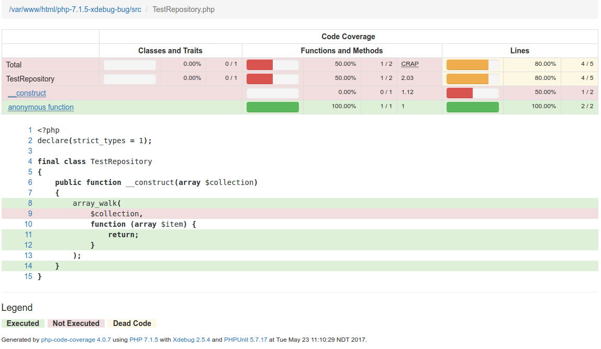

# php-7.1.5-code-coverage-test
Just a tmp repo for helping to debug a code coverage issue in PHP 7.1.5

To test this issue please run:
- `composer install` 
- `phpunit.sh` 
- Open the coverage file `build/artifacts/coverage/index.html` in a browser

I expect the `$collection` argument to be covered by the test, but it's not:

My PHP info is [php-cli-info.txt](php-cli-info.txt)
